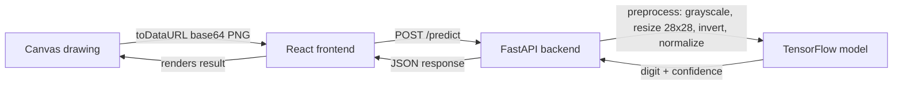

# Handwritten Digit Recognition

Draw a digit in the browser and a CNN trained on MNIST tells you what it is.


## Tech stack

| Layer    | Tech                                             |
| -------- | ------------------------------------------------- |
| Frontend | React, TypeScript, Vite, Tailwind CSS              |
| Backend  | FastAPI (Python)                                   |
| ML       | TensorFlow / Keras CNN trained on MNIST            |

## Architecture



## Project structure

```text
handwritten-digit-recognition/
├── frontend/            React + TypeScript + Vite + Tailwind client
│   └── src/
│       ├── components/  DrawingCanvas, PredictionResult
│       ├── lib/api.ts   Backend client
│       └── App.tsx
├── backend/             FastAPI server
│   ├── main.py          App + routes
│   ├── inference.py     Image preprocessing + model inference
│   ├── config.py        Settings (model path, CORS)
│   ├── schemas.py        Request/response models
│   └── tests/
├── model/                Training pipeline
│   ├── train.py          Trains and saves mnist_model.h5
│   ├── predict.py        CLI sanity check for a trained model
│   └── mnist_model.h5
├── dataset/               MNIST is downloaded at train time, not vendored here
└── docs/                  Screenshots and training plots
```

## Setup

### 1. Model

```bash
cd model
python -m venv .venv && source .venv/bin/activate   # .venv\Scripts\activate on Windows
pip install -r requirements.txt
python train.py   # downloads MNIST, trains ~8 epochs, saves mnist_model.h5
```

### 2. Backend

```bash
cd backend
python -m venv .venv && source .venv/bin/activate
pip install -r requirements.txt
uvicorn main:app --reload --port 8000
```

The backend loads `model/mnist_model.h5` at startup, so train the model first.

### 3. Frontend

```bash
cd frontend
npm install
cp .env.example .env
npm run dev
```

Open the printed local URL, draw a digit, and click **Predict**.

## API

**POST** `/predict`

```json
// Request
{ "image": "data:image/png;base64,..." }

// Response
{ "digit": 7, "confidence": 0.987 }
```

**GET** `/health` — liveness check.

## License

MIT
